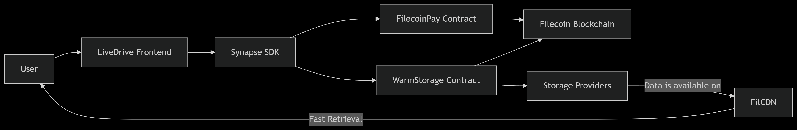

# LiveDrive

[](https://www.notion.so/LiveDrive-Filecoin-Onchain-Cloud-Cohort-90d5118ec28b4c16a83beeb8b8a0d906?source=copy_link)
[](https://opensource.org/licenses/MIT)

**Your permanent, programmable, and performant cloud drive.** LiveDrive offers a familiar cloud storage experience powered by the decentralized Filecoin network, combining hot storage performance with cold storage permanence.

## 🚀 Features

*   **Familiar UI:** Drag-and-drop upload, file management, and instant downloads.
*   **Verifiable Storage:** Cryptographic Proofs of Data Possession guarantee your files are always safe and available.
*   **Blazing-Fast Retrieval:** Files are served globally via the **FilCDN** network for CDN-like download speeds.
*   **Seamless Payments:** **Filecoin Pay** handles subscription billing via streaming payments, so you only pay for what you use.
*   **Truly Decentralized:** Your data is stored on the Filecoin network, not in a centralized silo. You own your data.

## 🛠️ Built With

This project demonstrates a deep integration with the **Filecoin Onchain Cloud** ecosystem.

*   **Frontend:** Next.js 14, React, TypeScript, Tailwind CSS
*   **Filecoin Onchain Cloud Services:**
    *   [`@synapsecns/sdk`](https://www.npmjs.com/package/@synapsecns/sdk) - The primary SDK for interacting with Filecoin services.
    *   **FilecoinWarmStorageService** - For initiating and managing fast, verified storage deals.
    *   **FilecoinPay** - For handling subscription payments via streaming FIL.
    *   **FilCDN** - For high-performance, low-latency content retrieval.
*   **Wallet Connection:** WalletConnect / MetaMask
*   **Development:** Hardhat, Figma

## 📦 Installation & Setup

Want to run LiveDrive locally? Follow these steps.

### Prerequisites

*   Node.js (v18 or higher)
*   npm, yarn, or pnpm
*   A MetaMask wallet with testnet FIL (get some from a Filecoin testnet faucet).

### 1. Clone the Repository

```bash
git clone https://github.com/your-username/livedrive.git
cd livedrive
```

### 2. Install dependencies

```bash
npm install
# or
yarn install
# or
pnpm install
```

### 3. Configure Environment Variables
Copy the example environment file and update the values. You will need to get API keys/URLs for the Filecoin services you are integrating with (e.g., a FilCDN gateway, RPC endpoints).

```bash
cp .env.example .env
```

### 4. Run the development server

```bash
npm run dev
# or
yarn dev
# or
pnpm dev
```

Open http://localhost:3000 with your browser to see the application.

Connect your wallet (configured for the correct Filecoin testnet) and start uploading!

## 🏗️ Architecture
A high-level overview of how LiveDrive works:
1. Frontend (Next.js): The user interface built with React.
2. Synapse SDK: The bridge between the frontend and Filecoin. It handles:
3. File preparation (chunking, hashing).
  - Interaction with `WarmStorageService` smart contract to start storage deals.
  - Interaction with `FilecoinPay` contract to manage subscriptions.
  - Filecoin Blockchain: Records storage deals, payment streams, and proofs.
4. Filecoin Storage Providers (SPs): Store the user's file data.
5. FilCDN: Caches stored data and serves it to users via a global CDN for fast retrieval.



## 🙋‍♂️ Getting Help
- Check our [documentation](https://github.com/GauravKarakoti/LiveDrive/blob/main/README.md).
- Open an [issue](https://github.com/GauravKarakoti/livedrive/issues) for bug reports or feature requests.
- Reach out to us on Twitter [@GauravKarakoti](https://twitter.com/GauravKarakoti).

---

**Disclaimer**: This is a demonstration project built for the Filecoin Onchain Cloud Cohort. Use at your own risk.
